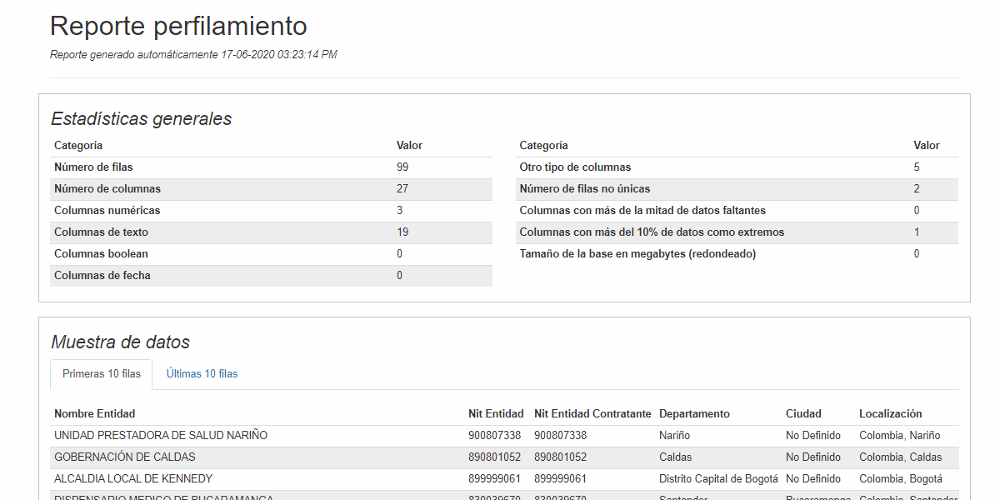

# LEILA - Librería de calidad de datos


## Descripción

La librería de calidad de datos tiene como objetivo principal ser una herramienta que facilite la verificación de contenido de bases de datos y dé métricas de calidad para que usuarios puedan decidir si sus bases de datos necesitan modificarse para ser utilizadas en los proyectos. La librería fue escrita en el lenguaje de programación de <em>Python</em> y puede analizar bases de datos estructurados que se conviertan en objetos dataframe. Contiene tres módulos principales, el módulo <strong>Calidad Datos</strong> para analizar cualquier base de datos, el módulo <strong>Datos gov</strong> para conectarse con los metadatos del Portal de Datos Abiertos de Colombia y utilizar sus bases de datos, y por último el módulo <strong>Reporte</strong> para exportar los resultados obtenidos en los dos anteriores.



La librería surge como resultado de un proyecto realizado entre la UCD (Unidad de Científicos de Datos - DNP) y el Ministerio de Tecnologías de la Información y las Comunicaciones (MinTIC) relacionado con realizar análisis descriptivos de la calidad de la información cargada al portal de Datos Abiertos de Colombia, durante el desarrollo del proyecto se identifica el interés por parte de diferentes actores en el proyecto al igual que el beneficio potencial de tener a la mano una librería que facilite describir la calidad de una base de datos, lo cual motivó a realizar la implementación de la librería.

- A continuación podrá consultar la siguiente información:
  - [Documentación](#documentaci%C3%B3n)
  - [Prerrequisitos](#prerrequisitos)
  - [Instalación](#instalaci%C3%B3n)
  - [Contribuciones](#contribuciones)
  - [Licencia](#licencia)
  - [Contacto](#contacto)

## Documentación

La librería cuenta con una documentación que detalla las funciones que la conforman, al igual que ejemplos de uso y demás información de interes relacionada con esta, para acceder a la documentación siga el siguiente link:

[Documentación - LEILA - Librería de calidad de datos.](https://jairoruizsaenz.github.io/test_sphinx/)

## Prerrequisitos

En esta etapa de desarrollo de la librería aún no se cuenta con un procedimiento de instalación automática de las dependencias necesarias, dado lo anterior, se requiere que el usuario tenga acceso a los scripts de la librería y previamente tenga instalado las librerías de <code>pandas</code>, <code>numpy</code>, <code>sodapy</code>, <code>phik</code>, <code>jinja2</code>.


## Instalación

Para la instalación de los [prerrequisitos](#prerrequisitos) de la librería se recomienda utilizar un gestor de paquetes como pip, al igual que por buenas prácticas se sugiere crear un entorno virtual que permita aislar las librerías y evitar conflictos de versiones con el entorno de desarrollo base del computador.

A continuación se presentan los pasos a seguir para la creación del entorno virtual e instalación de librerías requeridas.

- Creación del entorno virtual. Para esto se puede utilizar la librería <code>virtualenv</code>.

    ```
    virtualenv env
    ```

- Activación del entorno virtual

    - En linux:
```
source env/bin/activate
```

    - En Windows:
```
source env/Scripts/activate
```

- Una vez se active el entorno virtual se pueden instalar los requerimientos utilizando el archivo de <strong>requirements.txt</strong>, este archivo contiene un listado de las librerias o dependencias necesarias para el correcto funcionamiento de la libreria de calidad de datos.

    ```
    pip install -r requirements.txt
    ```

- Para desactivar el entorno virtual usar el comando deactivate
    
    ```
    deactivate
    ```

De manera alterna se pueden instalar las diferentes librerías de manera independiente, a manera de ejemplo se muestra como instalar la librería <code>jinja2</code>.

```
pip install Jinja2
```

## Contribuciones

Para sugerir mejoras, cambios en la librería o seguir el avance de la solución de errores reportados, debe acceder a la sección de [Issues](https://jairoruizsaenz.github.io/test_sphinx/) del repositorio.

## Licencia

La librería LEILA - Calidad de datos se encuentra publicada bajo la licensia MIT <br />
Copyright (c) 2020 Departamento Nacional de Planeación - DNP Colombia

## Contacto

En caso de requerir comunicarse con la Unidad de Científicos de Datos (UCD) de la Dirección de Desarrollo Digital (DDD) del DNP, lo puede hacer mediante el correo electróncio ucd@dnp.gov.co